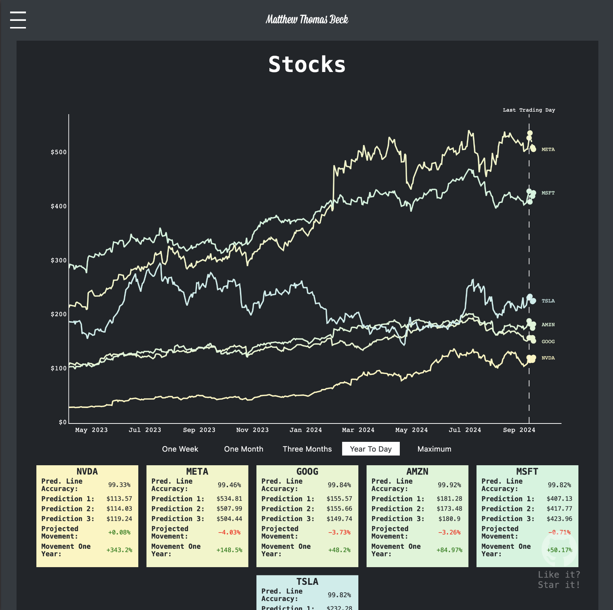
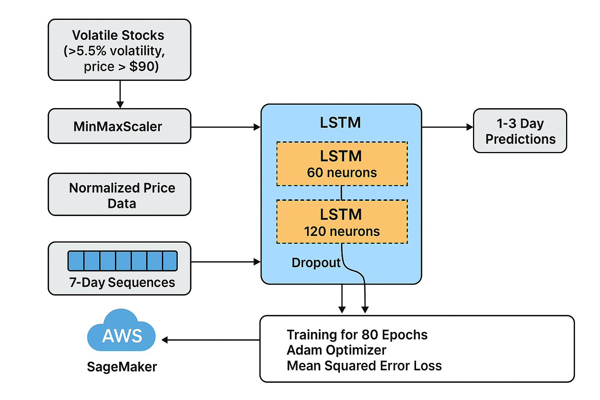

# Machine Learning Portfolio
### By [Matthew Thomas Beck](https://www.linkedin.com/in/matthewthomasbeck/)

Click [here](https://www.matthewthomasbeck.com/pages/machine_learning_portfolio.html) to check out the build

**Please consider:** if you like it, **star it!**

## Tech Stack
- **Language:** *Python*
- **Libraries:** *boto3, botocore, collections, datetime, json, keras, matplotlib, numpy, pandas, plotly, quandl, requests, sagemaker, scikit-learn, selenium, tensorflow, time, tqdm, yfinance, beautifulsoup4*

## Basic Information

This project employs a Long Short-Term Memory (LSTM) Recurrent Neural Network to predict stock price movements by analyzing historical market data

The system first identifies the most volatile stocks (with volatility > 5.5% and price > $90) from active market listings, then normalizes the price data using MinMaxScaler for optimal neural network training

The LSTM architecture processes 7-day sequences of historical closing prices through two LSTM layers (60 and 120 neurons) with dropout regularization to prevent overfitting, ultimately outputting predictions for the next 1-3 trading days

The model is trained for 80 epochs using the Adam optimizer and Mean Squared Error loss function, with cloud integration through AWS SageMaker for model training and S3 for data storage

By learning patterns from historical price movements, the AI can forecast short-term future prices and identify potential trading opportunities in volatile market conditions